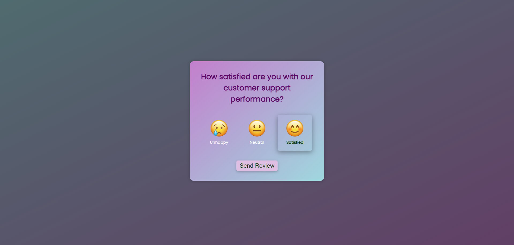
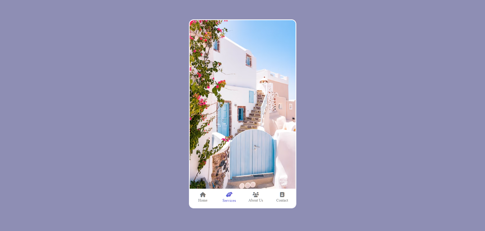
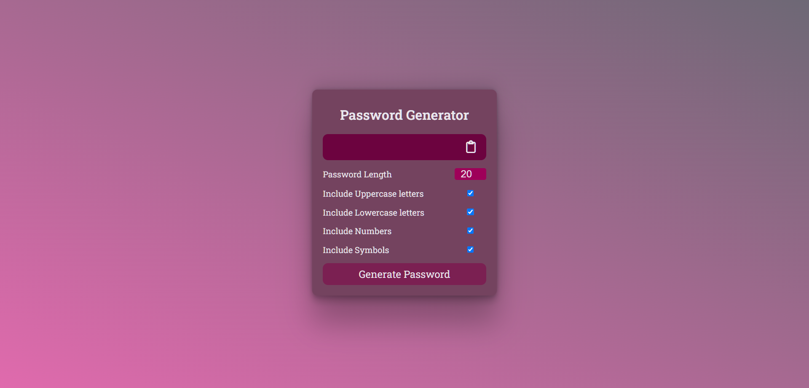
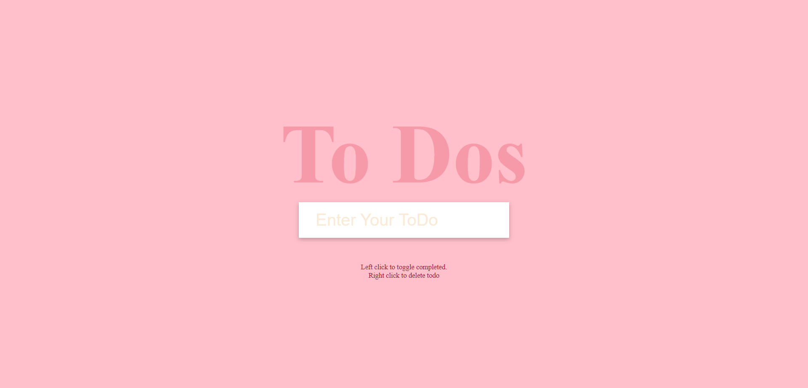

# Projects
#### Project 1 : Feedback UI
Description : User interface featuring three emojis for submitting reviews, followed by a thank you message upon review submission.

Demo : Watch the demo video on [YouTube](https://youtu.be/YjtTJRpZe4E).

#### Project 2 : Mobile Navigation
Description : Mobile navigation interface showcasing distinct menus and altering display images for each menu item in mobile view.

Demo : Watch the demo video on [YouTube](https://youtu.be/BgOjiKHKbQA).

#### Project 3 : Password Generator
Description :  Generate passwords with options for uppercase, lowercase, symbols, and numbers, adjustable length, and the ability to copy the generated password to the clipboard.

Demo : Watch the demo video on [YouTube]().

#### Project 4 : Todo List
Description :  To-do list project offering tasks completion and deletion functionalities, complemented by a light CSS background.

Demo : Watch the demo video on [YouTube]().

## Acknowledgement

- I'd like to give credit to Udemy Course created by Brad Traversy. "50 Projects in 50 Days"  
    https://www.udemy.com/course/50-projects-50-days/   

